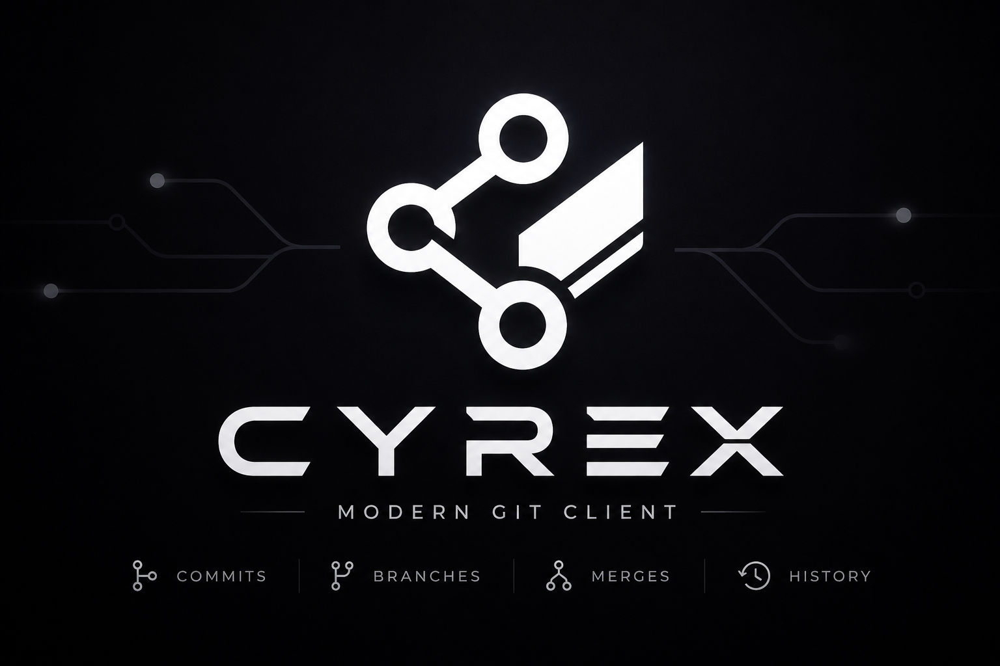

<p align="center">
  
</p>

# Cyrex

A calm, cross-platform visual Git client for Windows, Linux, and macOS. Cyrex turns everyday Git work — commit, branch, merge, rebase, stash, remotes — into a fast, readable, graphical experience without hiding what Git is actually doing.

<p align="center">
  <a href="https://github.com/Noxisan/Cyrex/actions/workflows/release.yml"></a>
  <a href="https://github.com/Noxisan/Cyrex/releases/latest"></a>
  <a href="#license"></a>
  
</p>

<p align="center">
  
</p>

## Highlights

- Visual commit graph with lanes, refs, and tags — the signature view, rendered from real repository state.
- Stage by file, hunk, and line; amend; signed commits where configured.
- Branch, merge, rebase (including interactive), cherry-pick, revert, stash.
- Side-by-side and inline diffs with syntax highlighting.
- Multi-repo management with quick switching.
- Calm, flat, minimal UI with a single crimson accent, light and dark themes, and 11 bundled languages.

## Install

Download the latest installer for your platform from the [Releases page](https://github.com/Noxisan/Cyrex/releases/latest):

- **Windows** — `Cyrex-Setup-*.exe` (NSIS installer) or `Cyrex-*.exe` (portable).
- **Linux** — `*.AppImage` or `*_amd64.deb`.
- **macOS** — `*-arm64.dmg` (Apple Silicon). The build is currently unsigned, so on first launch allow it under System Settings → Privacy & Security.

Prefer to build it yourself? See [Build from source](#build-from-source).

## Features

Cyrex aims to cover everyday Git work and then some — all rendered from real repository state, never faked.

**Core Git** — open and switch repositories, a visual commit graph with lanes/refs/tags, full working-tree status, and branch checkout/create/rename/delete. Commit, amend, and sign; merge, cherry-pick, and revert; rebase, including an interactive rebase UI.

**Staging & diffs** — stage and unstage by file, hunk, or line; inline and side-by-side diffs with syntax highlighting; visual image diffs (before/after with dimensions and size); and a Conventional Commit helper.

**Branches, tags & worktrees** — stash save/apply/pop/drop; lightweight and annotated tags; worktrees; submodules with status and init/update/sync; Git LFS awareness; and visual `.gitignore` editing with a live match preview.

**Remotes & hosting** — fetch, pull, push, and upstream tracking; conflict detection and a resolution UI; and credential-safe integration with GitHub, GitLab, and Bitbucket (browse, clone, create, link).

**Navigation & safety** — blame and per-file history, commit search by message/author/hash, an undo (reflog) surface, a command palette (Cmd/Ctrl+K), drag-and-drop branch merge/rebase, and clear confirmation on every destructive action.

**Experience** — an embedded terminal, multi-repo management, light/dark/system themes with accent palettes, and 11 bundled languages.

## Supported languages

English, Mandarin Chinese, Hindi, Spanish, French, Arabic (RTL), Bengali, Portuguese, Russian, Urdu (RTL), and German. English and German ship complete today; the rest fall back to English until their translations land. Canonical Git nouns (commit, branch, rebase, stash) are kept in English across all locales by convention.

## Build from source

Prerequisites: Node 20 or newer, and your platform's standard build tools.

```bash
npm install
npm run dev        # launch the app in development
npm run build      # type-check and build to out/
npm run dist       # package installers for the current platform
```

### Git engine note

Cyrex is a UI over real Git. The engine layer lives only in `src/main/git/` and the renderer never touches Git directly — all access goes through typed, zod-validated, allow-listed IPC.

The engine currently runs on the system `git` binary (the CLI fallback described in the project guide). The architecture leaves a clean seam for `nodegit` (libgit2) as the primary backend; because `nodegit` is a native module, integrating it requires `npm run rebuild` (electron-rebuild) after install and after any Electron upgrade. See `src/main/git/engine.ts`.

### Cross-platform builds

`npm run dist` packages installers for the machine it runs on. Building every OS from one machine isn't practical — macOS dmg needs macOS tooling, and Windows targets are most reliable on Windows.

Release installers are therefore produced by a GitHub Actions matrix (`ubuntu-latest`, `windows-latest`, `macos-latest`) that runs electron-builder per OS and publishes the artifacts to the GitHub Release — see [`.github/workflows/release.yml`](.github/workflows/release.yml). It triggers on each `v*` tag.

## Contributing

This project uses Gitflow with Conventional Commits and Semantic Versioning. Branch features from `develop`, use messages like `feat(graph): ...` or `fix(engine): ...`, and open pull requests against `develop`.

## License

MIT.
